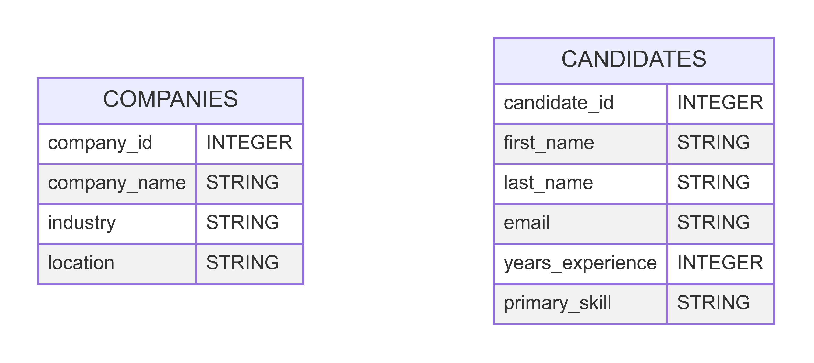

# COMPS III: Unit 6 Code Along

## Overview

Last week we created `candidates` and `companies` databases using SQL for our Tech Talent recruiting firm. This week, we'll be taking that file and converting it into a Python file using the `sqlite3` module. You don't need to install sqlite3 separately as it comes pre-installed with Python! The values that will be stored in each of these tables are represented in the entity diagrams shown below (this is the same as last week).

By the end of this code along, our recruiting firm will be able to store information in a Python file so that it can be manipulated and utilized as part of a broader program.

> This week’s code utilizes SQLite3 to implement the commands. This should have been installed last week, but here are the directions again if needed:
> - **Windows**: [Follow these directions](https://www.tutorialspoint.com/sqlite/sqlite_installation.htm).
> - **Apple**: Nothing at all! SQLite comes installed on all Macs. If for some reason you don’t have it, you can download it using [Homebrew](https://formulae.brew.sh/formula/sqlite).
> - **Linux**: Follow [these directions](https://www.digitalocean.com/community/tutorials/how-to-install-and-use-sqlite-on-ubuntu-20-04).

## Steps
1. Create a file called `tech_talent.db`.
2. The remainder of this code along can be done in `tech_talent.py`. At the top of the file, import the `sqlite3` module.
3. Create a connection variable and call `.connect()` to connect to the `tech_talent.db` file.
4. Create a cursor by calling `.cursor()` on the connection you created the previous step.
5. The `companies` and `candidates` tables may already exist in the database. Using `.execute()`, call the `DROP TABLE IF EXISTS` SQL command.
6. Create the `companies` and `candidates` tables using `.execute()` and `CREATE TABLE`.
7. Run the tests! The `test_companies_table_exists`, `test_candidates_table_exists`, `test_companies_table_columns`, and `test_candidates_table_columns` tests should now be passing.
8. Insert values into the `companies` and `candidates` tables using `.execute()` and `INSERT INTO...VALUES`.
9. Commit the transaction using the command `connection.commit()`
10. Using a `SELECT` command and `.execute()` get the data stored in each table. Call `.fetchall()` on the returned values. Print out the values in each table.
11. Print out the 2nd and 3rd candidates that were returned.
12. What data type is in this list? Use `type()` command on the data that was returned to show that it is a tuple.
13. We can access values the exact same way we access values in a list. Print out the 2nd candidates name to show this.
14. Create a SQL query so that you can print out only candidates that have a primary skill of `"Python"`. Save the values that are returned in the variable called `python_candidates`. 
15. Iterate through the data you got in the last step and print out candidates email that have Python has a skill.
16. Run the tests! The `test_python_candidates_genre` test should now be passing.
17. Create a SQL query so that you can print out only the `companies` name that are in an `industry` of `"Software"`.
18. Create a SQL query so that you can print out only those `candidates` name and primary skill that have more than 3 years of experience.
19. Create a SQL query to update John's email to the correct value of `john.smith@gmail.com`. Don't forget to commit these changes!
20. Update the candidate with a `candidate_id` of 5 wants to update their `primary_skill` to be `Python, SQL`. Don't forget to commit these changes!
21. Run the tests! `test_email_update` and `test_candidate5_update` should now be passing.
22. Delete the 'Cloud Nine' row from the `companies` table.
23. Delete all `candidates` that have a `primary_skill` of `"Cloud Architecture"`. Don't forget to commit the changes!
24. Run the tests! `test_cloud_nine_deleted`, `test_cloud_architecture_deleted`, and `test_final_tables` should now be passing.
25. Print out the remaining values in the `candidates` table. 
26. Close the connection